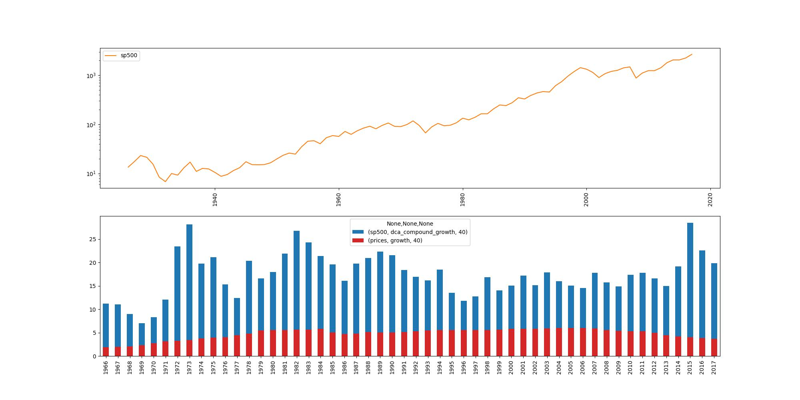
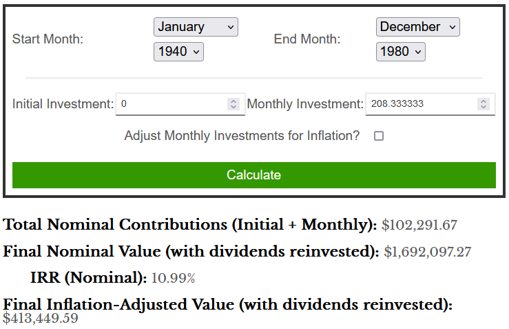

# SP500

## 1st analysis - simple DCA investment vs inflation
The first analysis of the SP500 is a very simple one: the unitary growth of a DCA (Dollar Cost Averaging, meaning, investing the same ammount each year) investment is calculated over each working lifespan of 40 years of the historical data. Additionaly, the growth of the prices (CPI, Consumer Price Index) over the each 40-year span is shown to account for the devaluation of money. This is a conservative approach, because not all invested dolars suffered the whole inflation of 40 years.

For example, if you invested 100,000$ between the years 1940-1980 (208.33$/month), your investment would grow to 1,500,000$  (15x growth), whereas the prices have a 4.5x growth.

This calculator confirms the results: https://ofdollarsanddata.com/sp500-dca-calculator/.

## Planned
- 2nd analysis - simple DCA investment + 4% rule retirement vs inflation
- 3rd analysis - whole life simulation with variable income, simple DCA investment + 4% rule retirement
- 4th analysis - whole life simulation with different strategies and their combinations:
    - rent+DCA investments
    - 1 house
    - multiple houses+landlording
    - 4% rule retirement
    - variable retirement
    - early retirement
    - ...